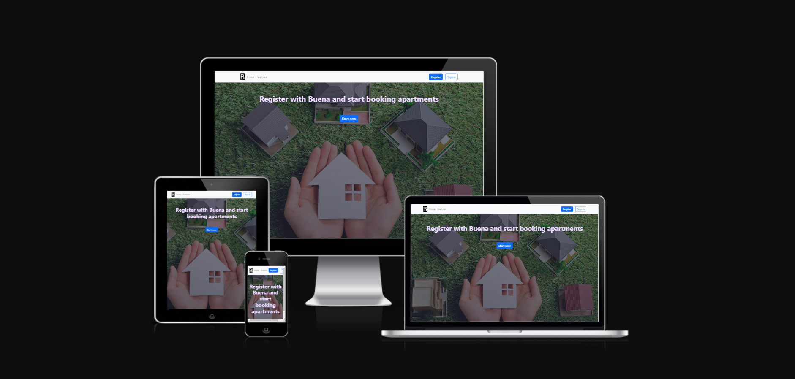

# Buena-app

Easy-to-use responsive and intuitive app for booking apartments. 

<small>A simple application with great potential, which is aimed at expanding the functionality and adding new options</small>

## Project Goals

The aim of this app is to provide an application form for tenants, so that they can register with Buena and start booking apartments.

## Features

- ### Header:

Main navigation with Logo and registration and sign in buttons. When users is not registered and wants to click the Sign in button, they receive a notification that registration is required. And when you click the Register button, a modal window with a registration form appears.

- ### Home Page:

Call-to-action headline and start button on the main page to provide quick access to the registration form.

- ### Account Page:

path to registered user page with data on the booking budget.

- ### Register Form:

Step 1:
fields for input, first name, last name and email. All fields are required. For email, there is a format hint before you start entering the data.
When you click the Next button, the data is checked and the borders of the fields are highlighted (green color for valid data and red color and error message for invalid data).Therefore, you can proceed to the next step only if the data format is correct.    
Step 2: a field for entering a phone number with a prompt for the required format.
Radio buttons for selecting a salary range.   
Step 3: Display of the entered data on the screen for double-checking and confirmation of all data by the user.  
You can also return to the previous step at any stage and change the data. Before clicking the Confirm button, the entered data is displayed in the form

React bootstrap https://react-bootstrap.netlify.app/docs/getting-started/introduction

React-step-prgress-bar

## Deployment

The site was deployed to Netlify.

The live link can be found [here](https://buena-project.netlify.app/)

1. Clone the repository;
2. Establish dependencies: npm install;
3. Project launching: npm run dev;

## Technologies and Tools

_The following technologies were used to create this project:_

1. React;
2. Vite;
3. React bootstrap;
4. Formik;
5. React-toastify;
6. Yup;

_The following tools helped to develop this project:_

1. Code editor VSC;
2. Googl Chrome Dev Tools;
3. Googl fonts;
4. Github - for version control;

## Features Left to Implement

Since I used routing, in the future I would expand the functionality by adding private routes for user registration and login. I would also add a database for storing registered users and a database of apartments. Therefore, when going to the user's page, the corresponding request would be made
